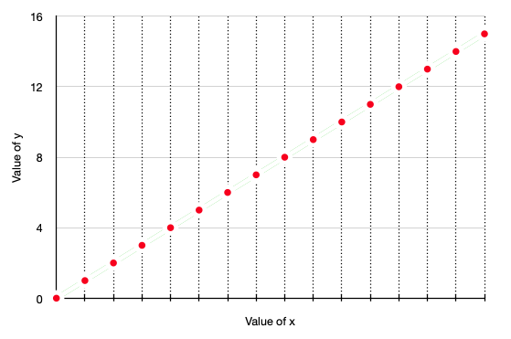
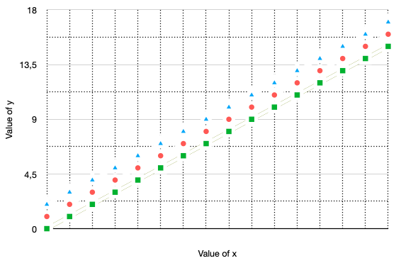
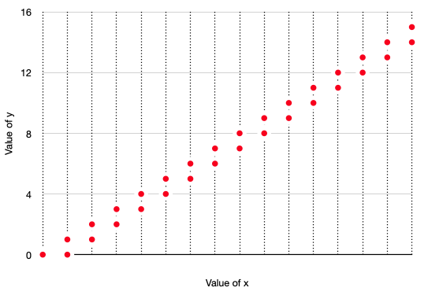

# Control Flow and Non-determinism in TLA+

[[Back to all operators]](./standard-operators.md)

**Author:** Igor Konnov

Non-determinism is one of the TLA+ features that makes it different from
programming languages. However, it is very easy to overlook it: There is no
special syntax for expressing non-determinism. In pure TLA+, whether your
specification is deterministic or not, depends on the evaluation of the initial
predicate and of the transition predicate. These are usually called `Init` and
`Next`. In the following, we first intuitively explain what non-determinism
means in the mathematical framework of TLA+, and then proceed with the
explanation that is friendly to computers and software engineers.

## Explaining non-determinism to a human

**States, transitions, actions, computations.** Every TLA+ specification comes
with a set of state variables. For instance, the following specification
declares two state variables `x` and `y`:

```tla
-------- MODULE coord ----------
VARIABLES x, y
Init == x = 0 /\ y = 0
Next == x' = x + 1 /\ y' = y + 1
================================
```

A _state_ is a mapping from state variables to TLA+ values. We do not go into
the mathematical depths of precisely defining TLA+ values. Due to the
background theory of ZFC, this set is well-defined and is not subject to
logical paradoxes. Basically, the values are Booleans, integers, strings, sets,
functions, etc.

In the above example, the operator `Init` evaluates to `TRUE` on exactly one
state, which we can conveniently write using the record constructor as follows:
`[x |-> 0, y |-> 0]`.

The operator `Next` contains primes (`'`) and thus accepts pairs of states,
which we call _transitions_. An operator over unprimed and primed variables
is called an _action_ in TLA+. Intuitively, the operator `Next` in our example
evaluates to `TRUE` on infinitely many pairs of states that look like follows:

```tla
<<[x |-> 0, y |-> 0], [x |-> 1, y |-> 1]>>
<<[x |-> 1, y |-> 1], [x |-> 2, y |-> 2]>>
<<[x |-> 2, y |-> 2], [x |-> 3, y |-> 3]>>
...
```

In our example, the second state of every transition matches the first state
of the next transition in the list. This is because the above sequence of
transitions describes the following sequence of states:

```tla
[x |-> 0, y |-> 0]
[x |-> 1, y |-> 1]
[x |-> 2, y |-> 2]
[x |-> 3, y |-> 3]
...
```

Actually, we have just written a computation of our specification.
A *finite computation* is a finite sequence of states `s_0, s_1, ..., s_k`
that satisfies the following properties:

  - The operator `Init` evaluates to `TRUE` on state `s_0`, and
  - The operator `Next` evaluates to `TRUE` on every pair of states `<<s_i, s_j>>`
    for `0 <= i < k` and `j = i + 1`.

We can also define an *infinite computation* by considering an infinite
sequence of states that are connected via `Init` and `Next` as above, but
without stopping at any index `k`.

Below we plot the values of `x` and `y` in the first 16 states with red dots.
Not surprisingly, we just get a line.



**Determinism and non-determinism.** Our specification is quite boring: It
describes exactly one initial state, and there is no variation in computing the
next states.  We can make it a bit more interesting:

```tla
------------ MODULE coord2 ---------------
VARIABLES x, y
Init == x = 0 /\ (y = 0 \/ y = 1 \/ y = 2)
Next == x' = x + 1 /\ y' = y + 1
==========================================
```

Now our plot has a bit more variation. It presents three computations
that are starting in three different initial states: `[x |-> 0, y |-> 0]`,
`[x |-> 0, y |-> 1]`, and `[x |-> 0, y |-> 2]`.



However, there is still not much variation in `Next`. For every state `s`,
we can precisely say which state follows `s` according to `Next`. We can
define `Next` as follows (note that `Init` is defined as in `coord`):

```tla
------------ MODULE coord3 -----------------
VARIABLES x, y
Init == x = 0 /\ y = 0
Next == x' = x + 1 /\ (y' = x \/ y' = x + 1)
============================================
```

The following plot shows the states that are visited by the computations
of the specification `coord3`:



Notice that specification `coord` describes one infinite computation (and
infinitely many finite computations that are prefixes the infinite
computation).  Specification `coord2` describes three infinite computations.
Specification `coord3` describes infinitely many infinite computations: At
every step, `Next` may choose between `y' = x` or `y' = x+1`.

Why are these specifications so different? The answer lies in non-determinism.
Specification `coord` is completely deterministic: There is just one state that
evaluates `Init` to `TRUE`, and every state is the first component of exactly
one transition, as specified by `Next`. Specification `coord2` has
non-determinism in the operator `Init`. Specification `coord3` has
non-determinism in operator `Next`.

**Discussion.**
So far we have been talking about the intuition. If you like to know more about
the logic behind TLA+ and the semantics of TLA+, check Chapter 16 of
[[Specifying Systems]] and [[The Specification Language TLA+]].

When we look at the operators like `Init` and `Next` in our examples, we can
guess the states and transitions. If we could ask our logician friend to guess
the states and transitions for us every time we read a TLA+ specification, that
would be great. But this approach does not scale well.

*Can we explain non-determinism to a computer?* It turns out that we can.
TLC and Apalache work because their authors managed to write programs
that are reasoning about
non-determinism. Of course, this comes with constraints on the structure of the
specifications. After all, people are much better at solving certain logical
puzzles than computers, though people get bored much faster than computers. 

To understand how TLC enumerates states, check Chapter 14 of [[Specifying
Systems]]. In the rest of this document, we focus on treatment of
non-determinism that is closer to Apalache.

## Explaining non-determinism to a computer

**Partial states.** Assume that `vars` is a tuple of all state variables,
that is

### Non-determinism in disjunctions

### Non-determinism in `\E x \in S: P`

### Non-determinism in Boolean `IF-THEN-ELSE`

For the deterministic use of `IF-THEN-ELSE`,
    see [Deterministic conditionals](./conditionals.md)

### Non-determinism in Boolean `CASE`

For the deterministic use of `CASE`,
    see [Deterministic conditionals](./conditionals.md)

Non-Boolean IF-THEN-ELSE

Non-Boolean CASE

[[Back to all operators]](./standard-operators.md)

[Specifying Systems]: http://lamport.azurewebsites.net/tla/book.html?back-link=learning.html#book
[The Specification Language TLA+]: https://members.loria.fr/SMerz/papers/tla+logic2008.pdf
